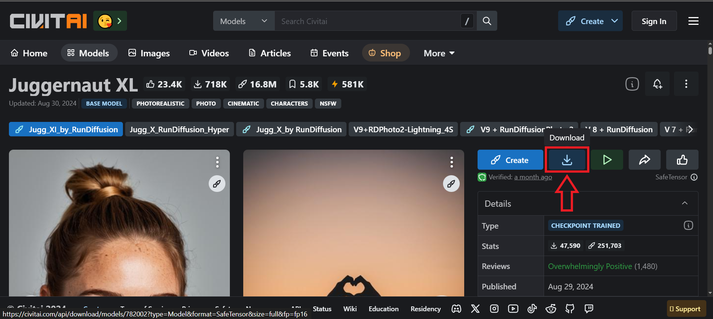

<div align="center">

# ComfyUI with Flux for Windows with Intel Arc GPU's

### I Pre-Installed:

### ComfyUI Manager

### ComfyUI Flux GGUF

### pythongosssss/ComfyUI-Custom-Scripts

----------------------------------------------------------------------------------------------------------------------------------------

**The most powerful and modular diffusion model GUI and backend.**


[![Website][website-shield]][website-url]
[![Dynamic JSON Badge][discord-shield]][discord-url]
[![Matrix][matrix-shield]][matrix-url]
<br>
[![][github-release-shield]][github-release-link]
[![][github-release-date-shield]][github-release-link]
[![][github-downloads-shield]][github-downloads-link]
[![][github-downloads-latest-shield]][github-downloads-link]

[matrix-shield]: https://img.shields.io/badge/Matrix-000000?style=flat&logo=matrix&logoColor=white
[matrix-url]: https://app.element.io/#/room/%23comfyui_space%3Amatrix.org
[website-shield]: https://img.shields.io/badge/ComfyOrg-4285F4?style=flat
[website-url]: https://www.comfy.org/
<!-- Workaround to display total user from https://github.com/badges/shields/issues/4500#issuecomment-2060079995 -->
[discord-shield]: https://img.shields.io/badge/dynamic/json?url=https%3A%2F%2Fdiscord.com%2Fapi%2Finvites%2Fcomfyorg%3Fwith_counts%3Dtrue&query=%24.approximate_member_count&logo=discord&logoColor=white&label=Discord&color=green&suffix=%20total
[discord-url]: https://www.comfy.org/discord

[github-release-shield]: https://img.shields.io/github/v/release/comfyanonymous/ComfyUI?style=flat&sort=semver
[github-release-link]: https://github.com/comfyanonymous/ComfyUI/releases
[github-release-date-shield]: https://img.shields.io/github/release-date/comfyanonymous/ComfyUI?style=flat
[github-downloads-shield]: https://img.shields.io/github/downloads/comfyanonymous/ComfyUI/total?style=flat
[github-downloads-latest-shield]: https://img.shields.io/github/downloads/comfyanonymous/ComfyUI/latest/total?style=flat&label=downloads%40latest
[github-downloads-link]: https://github.com/comfyanonymous/ComfyUI/releases


</div>

This ui will let you design and execute advanced stable diffusion pipelines using a graph/nodes/flowchart based interface. For some workflow examples and see what ComfyUI can do you can check out:
### [ComfyUI Examples](https://comfyanonymous.github.io/ComfyUI_examples/)

# Click here to jump to Install 👉[Install ComfyUI On Windows With Intel GPU Only](#Installation-On-Windows-With-Intel-GPUs-Only)

## Features
- Nodes/graph/flowchart interface to experiment and create complex Stable Diffusion workflows without needing to code anything.
- Fully supports SD1.x, SD2.x, [SDXL](https://comfyanonymous.github.io/ComfyUI_examples/sdxl/), [Stable Video Diffusion](https://comfyanonymous.github.io/ComfyUI_examples/video/), [Stable Cascade](https://comfyanonymous.github.io/ComfyUI_examples/stable_cascade/), [SD3](https://comfyanonymous.github.io/ComfyUI_examples/sd3/) and [Stable Audio](https://comfyanonymous.github.io/ComfyUI_examples/audio/)
- [Flux](https://comfyanonymous.github.io/ComfyUI_examples/flux/)
- Asynchronous Queue system
- Many optimizations: Only re-executes the parts of the workflow that changes between executions.
- Smart memory management: can automatically run models on GPUs with as low as 1GB vram.
- Works even if you don't have a GPU with: ```--cpu``` (Very Slow)
- Can load ckpt, safetensors and diffusers models/checkpoints. Standalone VAEs and CLIP models.
- Embeddings/Textual inversion
- [Loras (regular, locon and loha)](https://comfyanonymous.github.io/ComfyUI_examples/lora/)
- [Hypernetworks](https://comfyanonymous.github.io/ComfyUI_examples/hypernetworks/)
- Loading full workflows (with seeds) from generated PNG, WebP and FLAC files.
- Saving/Loading workflows as Json files.
- Nodes interface can be used to create complex workflows like one for [Hires fix](https://comfyanonymous.github.io/ComfyUI_examples/2_pass_txt2img/) or much more advanced ones.
- [Area Composition](https://comfyanonymous.github.io/ComfyUI_examples/area_composition/)
- [Inpainting](https://comfyanonymous.github.io/ComfyUI_examples/inpaint/) with both regular and inpainting models.
- [ControlNet and T2I-Adapter](https://comfyanonymous.github.io/ComfyUI_examples/controlnet/)
- [Upscale Models (ESRGAN, ESRGAN variants, SwinIR, Swin2SR, etc...)](https://comfyanonymous.github.io/ComfyUI_examples/upscale_models/)
- [unCLIP Models](https://comfyanonymous.github.io/ComfyUI_examples/unclip/)
- [GLIGEN](https://comfyanonymous.github.io/ComfyUI_examples/gligen/)
- [Model Merging](https://comfyanonymous.github.io/ComfyUI_examples/model_merging/)
- [LCM models and Loras](https://comfyanonymous.github.io/ComfyUI_examples/lcm/)
- [SDXL Turbo](https://comfyanonymous.github.io/ComfyUI_examples/sdturbo/)
- [AuraFlow](https://comfyanonymous.github.io/ComfyUI_examples/aura_flow/)
- [HunyuanDiT](https://comfyanonymous.github.io/ComfyUI_examples/hunyuan_dit/)
- Latent previews with [TAESD](#how-to-show-high-quality-previews)
- Starts up very fast.
- Works fully offline: will never download anything.
- [Config file](extra_model_paths.yaml.example) to set the search paths for models.

Workflow examples can be found on the [Examples page](https://comfyanonymous.github.io/ComfyUI_examples/)

## Shortcuts

| Keybind                            | Explanation                                                                                                        |
|------------------------------------|--------------------------------------------------------------------------------------------------------------------|
| Ctrl + Enter                       | Queue up current graph for generation                                                                              |
| Ctrl + Shift + Enter               | Queue up current graph as first for generation                                                                     |
| Ctrl + Alt + Enter                 | Cancel current generation                                                                                          |
| Ctrl + Z/Ctrl + Y                  | Undo/Redo                                                                                                          |
| Ctrl + S                           | Save workflow                                                                                                      |
| Ctrl + O                           | Load workflow                                                                                                      |
| Ctrl + A                           | Select all nodes                                                                                                   |
| Alt + C                            | Collapse/uncollapse selected nodes                                                                                 |
| Ctrl + M                           | Mute/unmute selected nodes                                                                                         |
| Ctrl + B                           | Bypass selected nodes (acts like the node was removed from the graph and the wires reconnected through)            |
| Delete/Backspace                   | Delete selected nodes                                                                                              |
| Ctrl + Backspace                   | Delete the current graph                                                                                           |
| Space                              | Move the canvas around when held and moving the cursor                                                             |
| Ctrl/Shift + Click                 | Add clicked node to selection                                                                                      |
| Ctrl + C/Ctrl + V                  | Copy and paste selected nodes (without maintaining connections to outputs of unselected nodes)                     |
| Ctrl + C/Ctrl + Shift + V          | Copy and paste selected nodes (maintaining connections from outputs of unselected nodes to inputs of pasted nodes) |
| Shift + Drag                       | Move multiple selected nodes at the same time                                                                      |
| Ctrl + D                           | Load default graph                                                                                                 |
| Alt + `+`                          | Canvas Zoom in                                                                                                     |
| Alt + `-`                          | Canvas Zoom out                                                                                                    |
| Ctrl + Shift + LMB + Vertical drag | Canvas Zoom in/out                                                                                                 |
| P                                  | Pin/Unpin selected nodes                                                                                           |
| Ctrl + G                           | Group selected nodes                                                                                               |
| Q                                  | Toggle visibility of the queue                                                                                     |
| H                                  | Toggle visibility of history                                                                                       |
| R                                  | Refresh graph                                                                                                      |
| Double-Click LMB                   | Open node quick search palette                                                                                     |
| Shift + Drag                       | Move multiple wires at once                                                                                        |
| Ctrl + Alt + LMB                   | Disconnect all wires from clicked slot                                                                             |

Ctrl can also be replaced with Cmd instead for macOS users

# Installation On Windows With Intel GPUs Only

## INTEL GPU's

ComfyUI with Flux for Windows with INTEL GPUs or CPU only available on the [releases page](https://github.com/Redtash1/ComfyUI-Windows-Intel-GPUs/releases/tag/v0.2.1) or Direct Download Link Below.

### Click Here 👉 [Direct link to download ComfyUI with Flux on Windows with Intel GPU's](https://github.com/Redtash1/ComfyUI-Windows-Intel-GPUs/releases/download/v0.2.1/ComfyUI_Windows_Intel_Portable.zip)

You need to have Git installed, so if you don't already have Git installed, Click here 👉 [Git](https://git-scm.com) to download. To install Git double click Git.exe and just keep clicking next until it's installed.

Once you have downloaded ComfyUI from the link above, double click and choose where you would like to unzip ComfyUI to, remember once you start installing stuff you can't move the folder. 

### Now download Models\Checkpoints

[Juggernaut XL](https://civitai.com/models/133005/juggernaut-xl). Put this in ComfyUi\models\checkpoints



Now download from comfyanonymous, Flux text encoders [clip_l.safetensors and t5xxl_fp8_e4m3fn.safetensors](https://huggingface.co/comfyanonymous/flux_text_encoders/tree/main). Put these in ComfyUI\models\clip


Now download GGUF from [city96/FLUX.1-schnell-gguf](https://huggingface.co/city96/FLUX.1-schnell-gguf/tree/main). Put this in ComfyUI\models\unet
   
 

Now download Vae from [Black Forest Labs](https://huggingface.co/black-forest-labs/FLUX.1-schnell/tree/main). Put this in ComfyUI\models\vae


## Install in this order:

### DISABLE INTEL IGPU BEFORE INSTALLING ANYTHING


1. Run 1st Intel Driver Install.bat

   This installs all the Intel Drivers and dependencies from the requirements.txt file.


   
# How to Launch ComfyUI:
## If you have an INTEL CPU you have to disable the IGPU in device manager under Display Adapters Intel(R) UHD Graphics 770 or ComfyUI will open but when you try to generate an image, it will fail because it will try to use the CPU's built-in graphics with is called IGPU. Once you have disabled it, keep Device Manager window open but minimize it to taskbar to remind you to re-enable it before you shutdown your computer. If disabling IGPU causes display problems re-enable it after you start ComfyUI.


Now pick if you want to run ComfyUI in Normal, Low VRAM or CPU only mode and double click to start ComfyUI.


### I Pre-Installed:

### ComfyUI Manager

### ComfyUI Flux GGUF

### pythongosssss/ComfyUI-Custom-Scripts

After you have launched ComfyUI, Drag & Drop Comfy Flux GGUf 4.json from ComfyUI folder onto open browser page to load Flux GGUF workload.


YOU WILL GET A POPUP WARNING IN RED THAT UNETLOADERGGUF FAILED TO LOAD.


TO EASILY FIX THIS, OPEN COMFYUI MANAGER


THEN CLICK CUSTOM NODES MANAGER


NOW  GO TO TOP LEFT CORNER, CLICK FILTER AND CHANGE TO INSTALLED, THEN GO DOWN TO COMFYUI-GGUF AND CLICK ON TRY FIX


AND FINALLY CLICK ON RESTART AND IT WILL RESTART COMFYUI AND YOU WILL BE GOOD TO START USING COMFYUI.


If you have any problems join this Discord Channel for help, Intel Insiders Community [ComfyUI for Intel Arc using IPEX](https://discord.gg/intel).


|

#### How do I share models between another UI and ComfyUI?

See the [Config file](extra_model_paths.yaml.example) to set the search paths for models. In the standalone windows build you can find this file in the ComfyUI directory. Rename this file to extra_model_paths.yaml and edit it with your favorite text editor.


# Notes

Only parts of the graph that have an output with all the correct inputs will be executed.

Only parts of the graph that change from each execution to the next will be executed, if you submit the same graph twice only the first will be executed. If you change the last part of the graph only the part you changed and the part that depends on it will be executed.

Dragging a generated png on the webpage or loading one will give you the full workflow including seeds that were used to create it.

You can use () to change emphasis of a word or phrase like: (good code:1.2) or (bad code:0.8). The default emphasis for () is 1.1. To use () characters in your actual prompt escape them like \\( or \\).

You can use {day|night}, for wildcard/dynamic prompts. With this syntax "{wild|card|test}" will be randomly replaced by either "wild", "card" or "test" by the frontend every time you queue the prompt. To use {} characters in your actual prompt escape them like: \\{ or \\}.

Dynamic prompts also support C-style comments, like `// comment` or `/* comment */`.

To use a textual inversion concepts/embeddings in a text prompt put them in the models/embeddings directory and use them in the CLIPTextEncode node like this (you can omit the .pt extension):

```embedding:embedding_filename.pt```


## How to show high-quality previews?

Use ```--preview-method auto``` to enable previews.

The default installation includes a fast latent preview method that's low-resolution. To enable higher-quality previews with [TAESD](https://github.com/madebyollin/taesd), download the [taesd_decoder.pth, taesdxl_decoder.pth, taesd3_decoder.pth and taef1_decoder.pth](https://github.com/madebyollin/taesd/) and place them in the `models/vae_approx` folder. Once they're installed, restart ComfyUI and launch it with `--preview-method taesd` to enable high-quality previews.

## How to use TLS/SSL?
Generate a self-signed certificate (not appropriate for shared/production use) and key by running the command: `openssl req -x509 -newkey rsa:4096 -keyout key.pem -out cert.pem -sha256 -days 3650 -nodes -subj "/C=XX/ST=StateName/L=CityName/O=CompanyName/OU=CompanySectionName/CN=CommonNameOrHostname"`

Use `--tls-keyfile key.pem --tls-certfile cert.pem` to enable TLS/SSL, the app will now be accessible with `https://...` instead of `http://...`.

> Note: Windows users can use [alexisrolland/docker-openssl](https://github.com/alexisrolland/docker-openssl) or one of the [3rd party binary distributions](https://wiki.openssl.org/index.php/Binaries) to run the command example above. 
<br/><br/>If you use a container, note that the volume mount `-v` can be a relative path so `... -v ".\:/openssl-certs" ...` would create the key & cert files in the current directory of your command prompt or powershell terminal.

## Support and dev channel

[Matrix space: #comfyui_space:matrix.org](https://app.element.io/#/room/%23comfyui_space%3Amatrix.org) (it's like discord but open source).

See also: [https://www.comfy.org/](https://www.comfy.org/)

## Frontend Development

As of August 15, 2024, we have transitioned to a new frontend, which is now hosted in a separate repository: [ComfyUI Frontend](https://github.com/Comfy-Org/ComfyUI_frontend). This repository now hosts the compiled JS (from TS/Vue) under the `web/` directory.

### Reporting Issues and Requesting Features

For any bugs, issues, or feature requests related to the frontend, please use the [ComfyUI Frontend repository](https://github.com/Comfy-Org/ComfyUI_frontend). This will help us manage and address frontend-specific concerns more efficiently.

### Using the Latest Frontend

The new frontend is now the default for ComfyUI. However, please note:

1. The frontend in the main ComfyUI repository is updated weekly.
2. Daily releases are available in the separate frontend repository.

To use the most up-to-date frontend version:

1. For the latest daily release, launch ComfyUI with this command line argument:

   ```
   --front-end-version Comfy-Org/ComfyUI_frontend@latest
   ```

2. For a specific version, replace `latest` with the desired version number:

   ```
   --front-end-version Comfy-Org/ComfyUI_frontend@1.2.2
   ```

This approach allows you to easily switch between the stable weekly release and the cutting-edge daily updates, or even specific versions for testing purposes.

### Accessing the Legacy Frontend

If you need to use the legacy frontend for any reason, you can access it using the following command line argument:

```
--front-end-version Comfy-Org/ComfyUI_legacy_frontend@latest
```

This will use a snapshot of the legacy frontend preserved in the [ComfyUI Legacy Frontend repository](https://github.com/Comfy-Org/ComfyUI_legacy_frontend).

# QA

### Which GPU should I buy for this?

[See this page for some recommendations](https://github.com/comfyanonymous/ComfyUI/wiki/Which-GPU-should-I-buy-for-ComfyUI)

